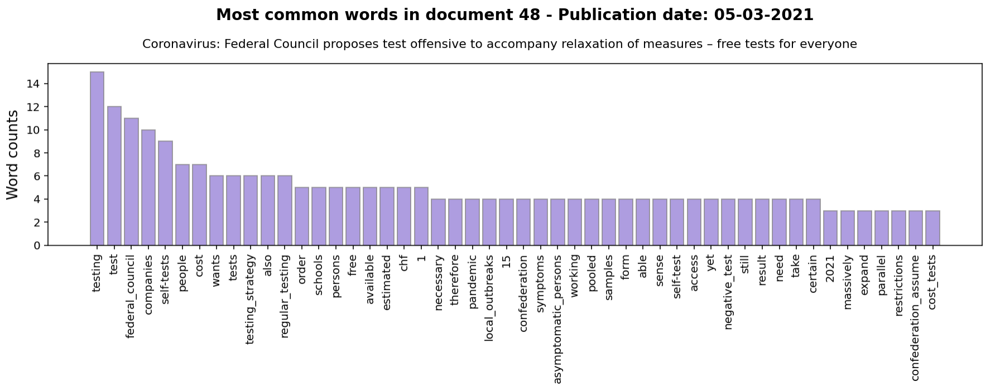
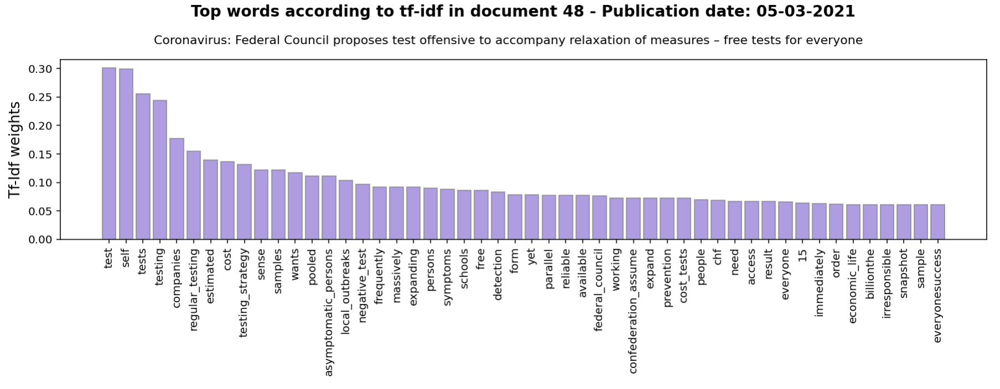

# Text Analytics

In this notebook, I look at different techniques for getting insights from text data. After applying common preprocessing steps for text data, I explored different tools (Bag of words and Tf-Idf term weighting) for extracting information about the content of text documents. First, I looked at word frequencies and detected word combinations that frequently appear together (collocations). Next, I looked at weighted word frequencies according to the tf-idf model. This model provides more informative statistics about key terms in a given document in the dataset compared to plain word frequencies. 

I scrapped publicly available [press releases by the Swiss Federal Council](https://www.admin.ch/gov/en/start/documentation/media-releases/media-releases-federal-council.html?dyn_startDate=01.01.2015) about the Coronavirus 2019 epidemic. I collected only press releases mentionning the term "coronavirus" in their title. The earliest press release is from February 28, 2020, and the last one from August 18, 2021.

### Word frequencies

One way to find out a bit more about what each press release is about is by looking at the most frequent tokens in each press release. Tokens that are mentioned several times in a text may reveal some information about the content of each press release.

### Tf-idf weighting model

Words that are very frequent across all documents in our corpus aren't necessarily "informative". For example, I'm working with a corpus of official press releases from the Swiss Federal Council about the Coronavirus disease. We naturally expect tokens such as "Federal Council", "Switzerland", "Coronavirus", "Federal government", etc., to appear very often in all press releases. The tf-idf model favors words, or terms, that are frequent in few documents.

We see that diminishing the importance of widespread words across all documents has helped to focus on rare words that are more informative about the content of individual press releases. 
